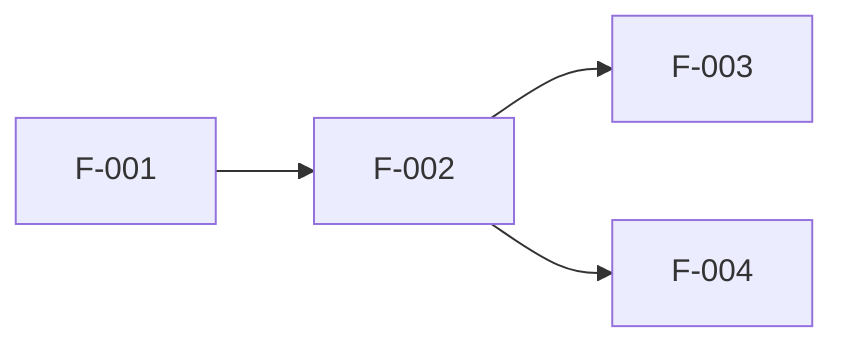

---
doc-type: breakdown
doc-kind: master
phase: PHASE_NAME
process: 2
iteration: 0
version: "1.0"
status: draft
input-refs:
  - path: "01-validation.md"
    version: "1.0"
created-at: "YYYY-MM-DD"
updated-at: "YYYY-MM-DD"
approved-by: null
approval-required: false
tags: []
---

# ② 構成要素の分解 — [PHASE_DISPLAY_NAME]

> **用途**: ①検証済みドキュメントを入力として、MECEな分解を行い、依存関係を明示する。

---

## 分解サマリ

| 分類 | 要素数 | メモ |
|------|--------|------|
| 機能要素 | 0 | |
| 非機能要素 | 0 | |
| 制約事項 | 0 | |
| スコープ外 | 0 | |

---

## 機能要素一覧

> 実現すべき機能を MECE に列挙する。

| ID | 要素名 | 説明 | 優先度 | 依存 |
|----|--------|------|--------|------|
| F-001 | | | High / Mid / Low | |

---

## 非機能要素一覧

> 性能・セキュリティ・可用性など機能以外の要求。

| ID | 要素名 | 指標・基準 | 依存 |
|----|--------|-----------|------|
| NF-001 | | | |

---

## 制約事項

| ID | 制約内容 | 根拠 |
|----|---------|------|
| C-001 | | |

---

## スコープ外

| ID | 項目 | 除外理由 |
|----|------|---------|
| OOS-001 | | |

---

## 依存関係マップ

---

## 次プロセスへの引き渡し事項

③意思決定プロセスで検討すべき選択肢・論点を記載する。

- 論点1:
- 論点2:
