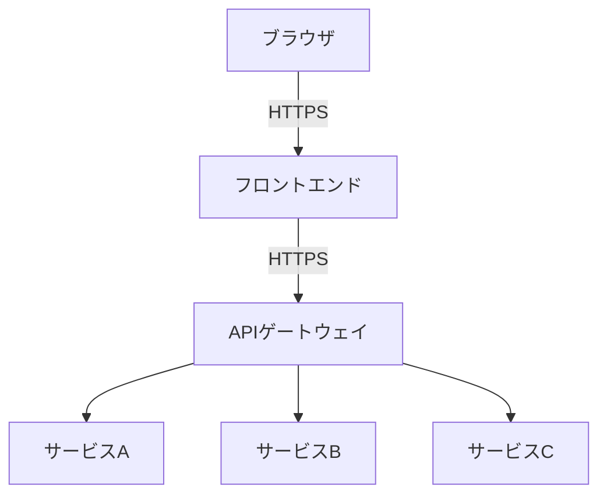
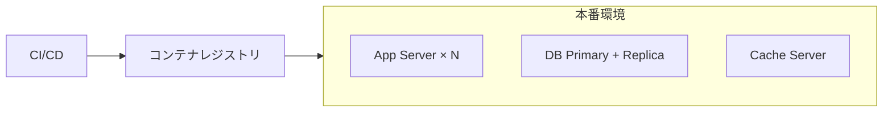

---
doc-type: artifact
doc-kind: master
phase: basic-design
process: 4
iteration: 1
version: "1.0"
status: draft
input-refs:
  - path: "docs/basic-design/03-decisions.md"
    version: "1.0"
  - path: "docs/requirements/04-artifact.md"
    version: "1.0"
created-at: "YYYY-MM-DD"
updated-at: "YYYY-MM-DD"
approved-by: null
approval-required: false
tags: []
---

# ④ アーキテクチャ設計書 — 基本設計

> **用途**: ③承認済みのアーキテクチャ方式決定を基に、システム全体のアーキテクチャを記述する。

---

## アーキテクチャ概要

| 項目 | 内容 |
| ------ | ------ |
| アーキテクチャパターン | |
| フロントエンド | |
| バックエンド | |
| データストア | |
| インフラ / デプロイ | |

---

## システム全体構成図

---

## コンポーネント仕様

| ID | コンポーネント名 | 技術スタック | 責務 | 主要API/IF | 依存 |
| ---- | -------------- | ------------ | ------ | ----------- | ------ |
| COMP-001 | | | | | |

---

## インタフェース定義（概要）

> 詳細なエンドポイント仕様は詳細設計フェーズで定義する。

| IF-ID | 提供元 | 利用先 | プロトコル | 概要 |
| ------- | -------- | -------- | ---------- | ------ |
| IF-001 | | | REST / gRPC / Event | |

---

## データストア設計（概要）

> 詳細なスキーマは詳細設計フェーズで定義する。

| DS-ID | 名称 | 製品 | 用途 | 主な格納データ | レプリケーション |
| ------- | ------ | ------ | ------ | ------------ | -------------- |
| DS-001 | | | | | |

## データフロー概要

---

## 非機能要件の実現方式

| 非機能要件 | 目標値 | 実現方式 | 担当コンポーネント |
| --------- | ------- | --------- | ---------------- |
| 性能（レスポンスタイム） | | キャッシュ / CDN / etc | |
| セキュリティ | | 認証方式 / 暗号化 / etc | |
| 可用性 | | 冗長構成 / フェイルオーバー | |
| スケーラビリティ | | 水平 / 垂直スケール | |

---

## デプロイ構成

---

## 技術スタック決定一覧

| カテゴリ | 採用技術 | バージョン | 選定理由 |
| --------- | --------- | ---------- | --------- |
| フロントエンド | | | |
| バックエンド | | | |
| DB | | | |
| キャッシュ | | | |
| インフラ | | | |
| CI/CD | | | |

---

## 変更履歴

| バージョン | 日付 | 変更内容 | 変更者 |
| --------- | ------ | --------- | -------- |
| 1.0 | YYYY-MM-DD | 初版作成 | |
