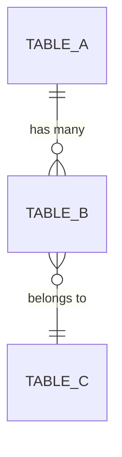

---
doc-type: artifact
doc-kind: master
phase: detailed-design
process: 4
layer: "L3"
artifact-type: schema
component-id: "{compId}"
iteration: 1
version: "1.0"
status: draft
input-refs:
  - path: "docs/detailed-design/components/{compId}/04-artifact-{compId}.md"
    version: "1.0"
created-at: "YYYY-MM-DD"
updated-at: "YYYY-MM-DD"
approved-by: null
approval-required: false
tags: []
---

# ④ DBスキーマ — {compId}

> **用途**: コンポーネント `{compId}` のDBテーブル定義・ER図・インデックス方針。

---

## ER図



---

## テーブル定義

### テーブル: `table_name`

```sql
CREATE TABLE table_name (
    id          BIGSERIAL PRIMARY KEY,
    -- フィールド定義
    created_at  TIMESTAMP NOT NULL DEFAULT NOW(),
    updated_at  TIMESTAMP NOT NULL DEFAULT NOW()
);
```

| カラム名 | 型 | NULL | デフォルト | 説明 | インデックス |
|---------|---|------|----------|------|-----------|
| id | BIGINT | NOT NULL | AUTO | PK | PK |

---

## インデックス方針

| テーブル | インデックス | 対象カラム | 種別 | 理由 |
|---------|-----------|---------|------|------|
| | | | BTREE / HASH | |

---

## 変更履歴

| バージョン | 日付 | 変更内容 | 変更者 |
|---------|------|---------|--------|
| 1.0 | YYYY-MM-DD | 初版作成 | |
