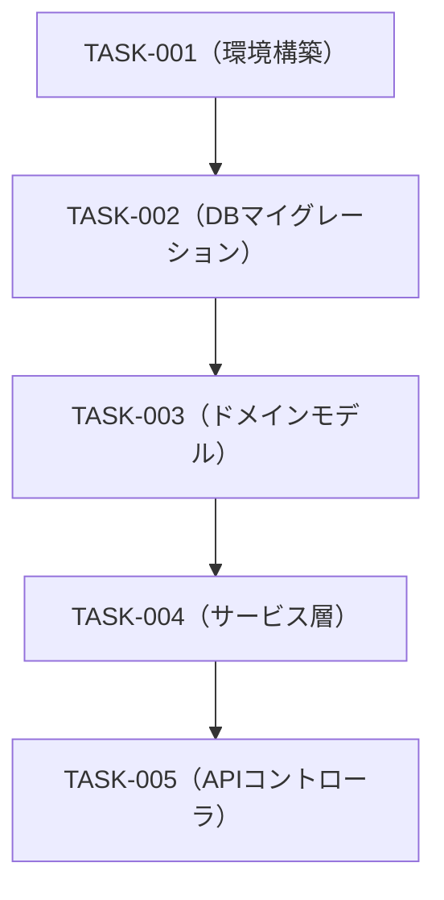

---
doc-type: breakdown
doc-kind: master
phase: implementation
process: 2
iteration: 1
version: "1.0"
status: draft
input-refs:
  - path: "docs/implementation/01-validation.md"
    version: "1.0"
created-at: "YYYY-MM-DD"
updated-at: "YYYY-MM-DD"
approved-by: null
approval-required: false
tags: []
---

# ② コーディングタスクリスト — 実装（TDD）

> **用途**: 詳細設計書からコーディングタスク（チケット）をMECEに分解し、TDDサイクルの実行順序を決定する。
> タスクは `Red（テスト作成）→ Green（実装）→ Refactor` の単位で定義する。

---

## タスク分解サマリ

| 分類 | タスク数 | 推定工数（h） |
| ------ | --------- | ----------- |
| 環境構築 / 共通基盤 | 0 | |
| DBマイグレーション | 0 | |
| ドメインモデル / エンティティ | 0 | |
| リポジトリ / データアクセス層 | 0 | |
| サービス / ビジネスロジック層 | 0 | |
| APIコントローラ / ハンドラ層 | 0 | |
| 認証・認可 | 0 | |
| テスト（E2E・インテグレーション） | 0 | |
| **合計** | **0** | |

---

## コーディングタスク一覧

> 各タスクには対応するテストケースIDを紐付ける（TDD: Red フェーズの根拠）。

| TASK-ID | カテゴリ | タスク名 | 対応TC-ID | 対応API-ID / TBL-ID | 優先度 | ステータス | 出力先 (`src/`) |
| --------- | --------- | --------- | --------- | ----------------- | -------- | ----------- | -------------- |
| TASK-001 | 環境構築 | プロジェクト初期化 | — | — | High | Not Started | `src/` |
| TASK-002 | DBマイグレーション | テーブル作成 | — | TBL-001 | High | Not Started | `src/db/migrations/` |
| TASK-003 | ドメインモデル | エンティティ定義 | TC-U-001 | MDL-001 | High | Not Started | `src/domain/` |
| TASK-004 | サービス層 | ビジネスロジック実装 | TC-U-002 | API-001 | High | Not Started | `src/services/` |
| TASK-005 | APIコントローラ | エンドポイント実装 | TC-I-001 | API-001 | High | Not Started | `src/api/` |

---

## 実装順序（依存関係考慮）

---

## TDDサイクル実行計画

各タスクは以下のサイクルで実行する：

1. **Red**: `TC-ID` で定義されたテストコードを `src/tests/` に作成 → テスト失敗を確認
2. **Green**: テストが通る最小実装を `src/` に作成 → テスト成功を確認
3. **Refactor**: コードの冗長性・重複を除去、可読性向上 → テストが引き続き全パスすることを確認

---

## ③意思決定プロセスへの論点

- 論点1: 実装順序の妥当性（依存関係・並列化可否）
- 論点2: リファクタリングの方針・タイミング
- 論点3: コードレビューの粒度（タスク単位 / フィーチャー単位）
